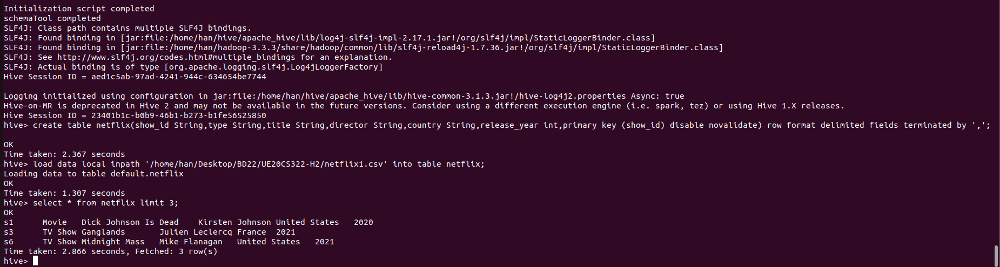

# Hive Installation Guide and HQL Hands On - H2

## Step 1 - Install hive by executing the shell script provided

First provide both the shell scripts the necessary permissions

```bash
chmod +x *.sh 
```

To install hive run the following command:

```bash
./install-hive.sh
```

Start hive shell using the following command:

```bash
./start-hive.sh
```
## TASK 1 - Create tables, partitions and buckets in hive.


Download the dataset "netflix1.csv" provided in the <a href="https://drive.google.com/drive/u/0/folders/1_woAsnz9hY798NE-41LX7owmupoS_1uM" target="_blank">link</a>

<b></b>

| attribute     | Description                  | DataType  |
| ------------- |:-------------:               | -----:    |
| show_id       | unique values                | String    |
| type          | Content(Tv show or Movie)    | String    |
| title         | Title                        | String    |
| director      | Director of the show or movie| String    |
| country       | Country of the show or movie | String    |
| release_year  | Content release year         | int       |

### TABLE

Create a table with the same structure as given in csv file

```bash
create table netflix(show_id String,type String,title String,director String,country String,release_year int,primary key (show_id) disable novalidate);
```

Now load the csv file into the netflix table created

```bash
load data local inpath 'PATH_TO_netflix1.csv_FILE' into table netflix;
```

Since the dataset is huge lets query the first 3 records in the database.
When you perform "select * from tablename", Hive fetches the whole data from file as a FetchTask rather than a mapreduce task which just dumps the data as it is without doing anything on it. This is similar to "hadoop dfs -text <filename>".Therefore when queried using SELECT, FILTER, LIMIT, this property skips mapreduce and uses FETCH task.As a result Hive can execute query without running mapreduce task as shown below.

```bash
select * from netflix limit 3;
```
Take a screenshot of the terminal output


Hive is a data warehouse database for Hadoop, all database and table data files are stored at HDFS location /user/hive/warehouse by default.

To check all database and table files stored use the following command

```bash
cd
hdfs dfs -ls /user/hive/warehouse
```



### PARTITION

Hive organizes tables into partitions. It is a way of dividing a table into related parts based on the values of partitioned columns such as type,country etc. Using partition, it is easy to query a portion of the data.
For example, a table named Employee contains employee data such as id, name, dept, and yoj (i.e., year of joining). Suppose you need to retrieve the details of all employees who joined in 2012. A query searches the whole table for the required information. However, if you partition the employee data with the year and store it in a separate file, it reduces the query processing time. 

Firstly enable dynamic partition using the commands as follows:

```bash
set hive.exec.dynamic.partition=True;
set hive.exec.dynamic.partition.mode=nonstrict;
```

To create a partitioned table we have to follow the below command:

```bash
create table netflix_partition(title String,director String,country String,release_year int) partitioned by (type String);
```
Now we will load the data into the partitioned table using the following command

```bash
insert into netflix_partition partition(type) select title,director,country,release_year,type from netflix;
```


To check the partitions stored in hadoop data warehouse:

```bash
cd
hdfs dfs -ls /user/hive/warehouse/netflix_partition
```

