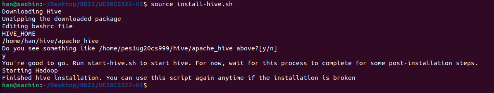
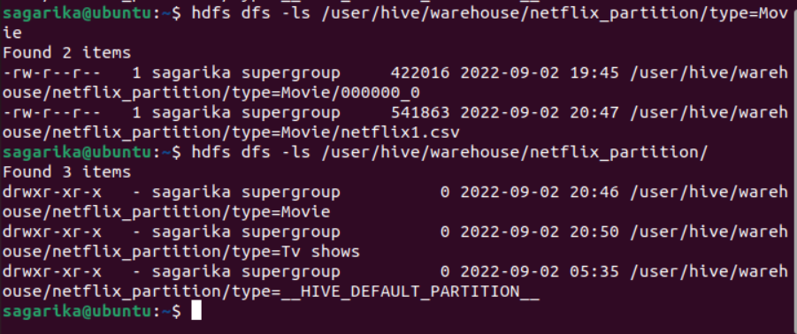
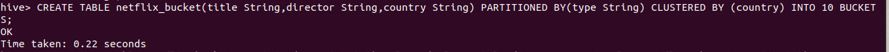
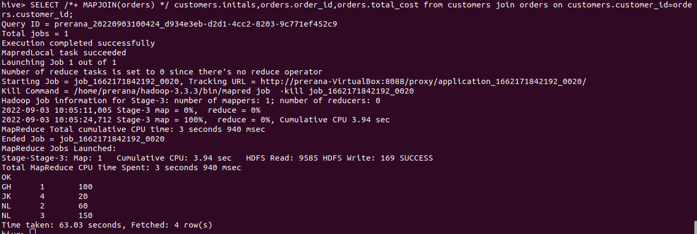

# Hive Installation Guide and HQL Hands On - H2

## Step 1 - Install hive by executing the shell script provided

First provide both the shell scripts the necessary permissions

```bash
chmod +x *.sh 
```

To install hive run the following command ,if hive is launched your installation is successfull:

```bash
./install-hive.sh
```

Start hive shell using the following command:

```bash
./start-hive.sh
```
## TASK 1 - Create tables, partitions and buckets in hive.


Download the dataset "netflix1.csv" provided in the <a href="https://drive.google.com/drive/u/0/folders/1_woAsnz9hY798NE-41LX7owmupoS_1uM" target="_blank">link</a>

<b></b>

| attribute     | Description                  | DataType  |
| ------------- |:-------------:               | -----:    |
| show_id       | unique values                | String    |
| type          | Content(Tv show or Movie)    | String    |
| title         | Title                        | String    |
| director      | Director of the show or movie| String    |
| country       | Country of the show or movie | String    |
| release_year  | Content release year         | int       |

### TABLE

Create a table with the same structure as given in csv file

```bash
create table netflix(show_id String,type String,title String,director String,country String,release_year int,primary key (show_id) disable novalidate);
```

Now load the csv file into the netflix table created

```bash
load data local inpath 'PATH_TO_netflix1.csv_FILE' into table netflix;
```

Since the dataset is huge lets query the first 3 records in the database.
When you perform "select * from tablename", Hive fetches the whole data from file as a FetchTask rather than a mapreduce task which just dumps the data as it is without doing anything on it. This is similar to "hadoop dfs -text <filename>".Therefore when queried using SELECT, FILTER, LIMIT, this property skips mapreduce and uses FETCH task.As a result Hive can execute query without running mapreduce task as shown below.

```bash
select * from netflix limit 3;
```
Take a screenshot of the terminal output



Hive is a data warehouse database for Hadoop, all database and table data files are stored at HDFS location /user/hive/warehouse by default.

To check all database and table files stored use the following command

```bash
cd
hdfs dfs -ls /user/hive/warehouse
```


### PARTITION

Hive organizes tables into partitions. It is a way of dividing a table into related parts based on the values of partitioned columns such as type,country etc. Using partition, it is easy to query a portion of the data.
For example, a table named Employee contains employee data such as id, name, dept, and yoj (i.e., year of joining). Suppose you need to retrieve the details of all employees who joined in 2012. A query searches the whole table for the required information. However, if you partition the employee data with the year and store it in a separate file, it reduces the query processing time. 

Firstly enable dynamic partition using the commands as follows:

```bash
set hive.exec.dynamic.partition=True;
set hive.exec.dynamic.partition.mode=nonstrict;
```

To create a partitioned table we have to follow the below command:

```bash
create table netflix_partition(title String,director String,country String,release_year int) partitioned by (type String);
```
Now we will load the data into the partitioned table using the following command

```bash
insert into netflix_partition partition(type) select title,director,country,release_year,type from netflix;
```


To check the partitions stored in hadoop data warehouse:

```bash
cd
hdfs dfs -ls /user/hive/warehouse/{PATH}
```



### BUCKETS

Tables or partitions are sub-divided into buckets, to provide extra structure to the data that may be used for more efficient querying. Bucketing works based on the value of hash function of some column of a table.

The command below allows the correct number of reducers and the cluster by column to be automatically selected based on the table:

```bash
set hive.enforce.bucketing=True;
```

Create bucketing on country column on top of partitioning by type and insert data:

```bash
CREATE TABLE netflix_bucket(title String,director String,country String) PARTITIONED BY(type String) CLUSTERED BY (country) INTO 10 BUCKETS;
insert into table netflix_bucket partition(type='Movie') select title,director,country from netflix where type='Movie';
```



To check the buckets stored in hadoop data warehouse:

```bash
cd
hdfs dfs -ls /user/hive/warehouse/{PATH}
```


## TASK 2- HQL Map Join and Normal Join

### Problem statement : 
Given two csv files customers.csv and orders.csv, create two tables namely customers and orders using the same structure in the csv file,load the data from csv files to the tables.Perform MapJoin and normal Join operations in hive.


Download the dataset "customers.csv" and "orders.csv" provided in the <a href="https://drive.google.com/drive/u/0/folders/1_woAsnz9hY798NE-41LX7owmupoS_1uM" target="_blank">link</a>

### ORDERS

| attribute     | Description                  | DataType  |
| ------------- |:-------------:               | -----:    |
| customer_id   | unique values                | int       |
| order_id      | unique values                | int       |
| order_date    | order date                   | date      |
| total_cost    | Total Cost                   | int       |

### CUSTOMERS 

| attribute     | Description                  | DataType  |
| ------------- |:-------------:               | -----:    |
| customer_id   | unique values                | int       |
| initals       | Customer Initials            | String    |
| street        | Street                       | String    |
| country       | Country                      | String    |

Similar to Task1 create tables and load data into the created tables.

```bash
create table customers(customer_id String,initals String,street String,country String);
create table orders(customer_id String,order_id String,order_date date,total_cost int);
```


```bash
load data local inpath 'PATH_TO_customers.csv_FILE' into table customers;
load data local inpath 'PATH_TO_orders.csv_FILE' into table orders;
```

Let us first understand the functionality of normal join,

Whenever, we apply join operation, the job will be assigned to a Map Reduce task which consists of two stages- a ‘Map stage’ and a ‘Reduce stage’. A mapper’s job during Map Stage is to “read” the data from join tables and to “return” the ‘join key’ and ‘join value’ pair into an intermediate file. Further, in the shuffle stage, this intermediate file is then sorted and merged. The reducer’s job during reduce stage is to take this sorted result as input and complete the task of join.


```bash
select customers.initials,orders.order_id,orders.total_cost from customers join orders on customers.customer_id=orders.customer_id;
```

As you can see in normal join all the task will be performed by both mapper and reducer.


A table can be loaded into the memory completely within a mapper without using the Map/Reducer process. It reads the data from the smaller table and stores it in an in-memory hash table and then serializes it to a hash memory file, thus substantially reducing the time. It is also known as Map Side Join in Hive. Basically, it involves performing joins between 2 tables by using only the Map phase and skipping the Reduce phase. A time decrease in your queries’ computation can be observed if they regularly use a small table joins.Map-side join helps in minimizing the cost that is incurred for sorting and merging in the shuffle and reduce stages.Map-side join also helps in improving the performance of the task by decreasing the time to finish the task.

Before running the query, we have to set the below property to true:

```bash
set hive.auto.convert.join=true
```
```bash
SELECT /*+ MAPJOIN(orders) */ customers.initials,orders.order_id,orders.total_cost from customers join orders on customers.customer_id=orders.customer_id;
```

The join query for map join is written as above, and the result we get is:



verify the time taken for both Map Join and Normal Join.